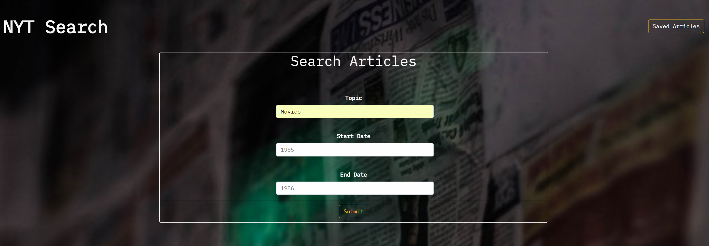
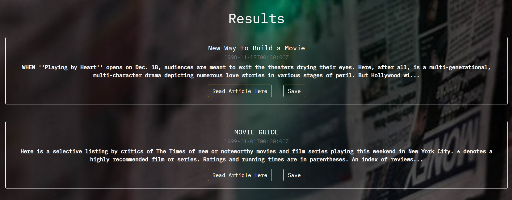

# **New York Times Article Search**
Ever wonder what happend in 1990, 1980, or even 1970? With the New York Times Article Search app you can find out the headline news from any date!  

## **Overview**
The NYT Article Search app allows the user to search the NYT api using topic, start date and end date parameters.  Once the user enters the search parameters, the app will bring back 10 articles from the NYT api.  From the results the user will be able to read the article or save the article.  The user can also choose to view all of the saved articles in the database.  Once in the saved articles view, the user will be able to read the article or delete the article from the database.

 Search Form               |  Results
:-------------------------:|:-------------------------:
  |    

   

## **Link To App**
Link coming soon

## **Technical Information**
This app was created by using the following:

* React
* MVC

The following npm packages were used:
* Axios
* Concurrently
* Express
* Mongoose
* React Router

## **Author**
Brandy Nicholson
